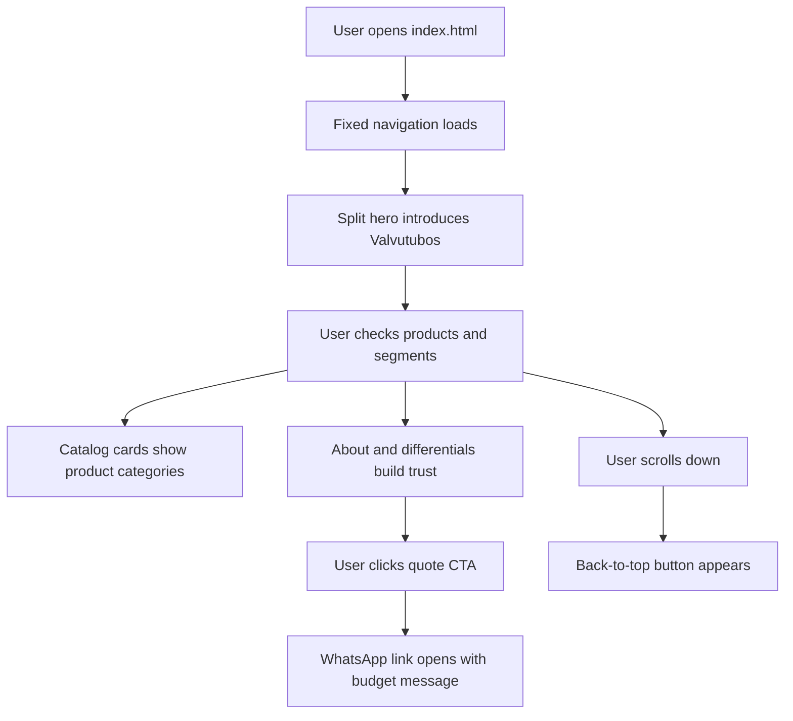
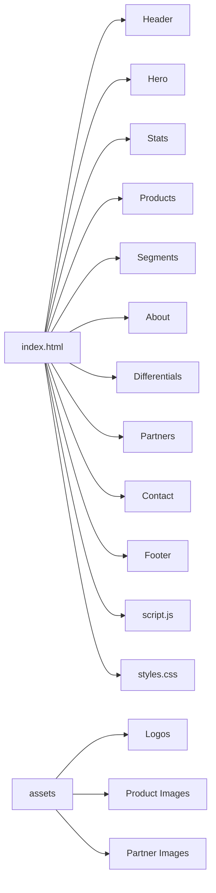

# Valvutubo — Institutional Website

<h3 align="center">
  A modern responsive institutional website for Valvutubos, built with HTML, CSS and JavaScript.
</h3>

<p align="center">
  <strong>Landing Page · HTML · CSS · JavaScript · SEO · Responsive Layout · Product Catalog · WhatsApp CTA</strong>
</p>

<p align="center">
  
  
  
  
</p>

---

## About the Project

**Valvutubo** is a static institutional website for **Valvutubos Comércio de Produtos Hidráulicos LTDA**, focused on presenting the company, its product mix and its commercial service for companies, industries and agribusiness.

The site was built with **HTML5**, **CSS3** and **vanilla JavaScript**, with semantic content, responsive sections, SEO metadata, structured data, product cards, partner area, contact information and WhatsApp quote buttons.

### Descrição em Português

O **Valvutubo** é um site institucional moderno para a Valvutubos, empresa de produtos hidráulicos localizada em Joinville/SC. O projeto apresenta a empresa, catálogo de produtos, segmentos atendidos, diferenciais, parceiros e canais de contato, com foco em compras empresariais, indústria, obras, manutenção e agronegócio.

---

## Project Goal

The goal of this project is to deliver a polished first version of the Valvutubos institutional website, improving brand perception, product presentation and search engine readiness.

This project focuses on:

- semantic HTML structure
- responsive institutional layout
- modern split hero section
- product catalog cards with images
- B2B-oriented commercial copy
- industry and agribusiness positioning
- WhatsApp quote CTAs
- contact and location information
- SEO metadata and structured data
- clean visual assets and brand usage
- responsive navigation
- floating back-to-top button
- no framework
- no build step

---

## Features

- Fixed header with responsive navigation
- Clean Valvutubos logo and icon assets
- Split hero section with product image
- Product catalog cards with responsive images
- Segments section for industry, companies and agribusiness
- About section with company history
- Differentials section with icon cards
- Partner brand area
- Contact section with phone, email, address and WhatsApp CTA
- Floating back-to-top button
- SEO title, description, keywords and Open Graph metadata
- JSON-LD structured data for local business information
- `robots.txt` and `sitemap.xml`
- Static files ready for simple hosting

---

## How It Works



---

## Architecture



---

## Tech Stack

| Technology | Usage |
|---|---|
| HTML5 | Page structure, content and SEO metadata |
| CSS3 | Visual design, responsive layout and components |
| JavaScript | Menu behavior, header scroll state and back-to-top visibility |
| SVG | Inline icons and brand assets |
| WhatsApp URL | Quote/contact CTA |
| JSON-LD | Structured business data |

---

## Project Structure

```bash
ValvutuboV1/
├── assets/
│   ├── catalog-produto-1.png
│   ├── catalog-produto-2.png
│   ├── catalog-produto-3.png
│   ├── catalog-produto-4.png
│   ├── catalog-produto-5.png
│   ├── catalog-produto-6.png
│   ├── hero-valvulas.png
│   ├── icone-valvutubos.png
│   ├── logo-valvutubos-git.svg
│   ├── sobre-valvutubos.jpg
│   └── partners/
├── index.html
├── styles.css
├── script.js
├── robots.txt
├── sitemap.xml
└── README.md
```

---

## Main Files

| File | Description |
|---|---|
| `index.html` | Main institutional website |
| `styles.css` | General styles, layout, responsiveness and visual components |
| `script.js` | Header, mobile menu and back-to-top behavior |
| `assets/` | Logos, product images, partner images and institutional visuals |
| `robots.txt` | Search engine crawling configuration |
| `sitemap.xml` | Sitemap for search engines |
| `README.md` | Project documentation |

---

## Running Locally

Clone the repository:

```bash
git clone https://github.com/yruamkaffer/ValvutuboV1.git
cd ValvutuboV1
```

Open the project in your browser:

```txt
index.html
```

You can also run a local static server:

```bash
python -m http.server 4173
```

Then open:

```txt
http://localhost:4173/
```

No dependency installation is required.

---

## Page Sections

### Header

The header includes the Valvutubos logo, navigation links and a WhatsApp quote button.

### Hero

The hero introduces the company with a split text/image layout, focused on hydraulic products for industry, companies and agribusiness.

### Products

The catalog section presents product categories such as:

- Tubos e conexões
- Válvulas e registros
- Acessórios industriais
- Manutenção e utilidades
- Rede de incêndio
- Agronegócio

### Segments

The website highlights commercial service for:

- Grandes indústrias
- Empresas e construtoras
- Agronegócio

### About

The about section describes Valvutubos as a company founded in Joinville, Santa Catarina, on July 8, 2015, focused on quality products, technical support and long-term partnerships.

### Contact

The contact section includes:

- WhatsApp quote CTA
- email
- phone
- business address
- location link

---

## CSS Highlights

The stylesheet includes:

- CSS variables
- global reset
- responsive container
- fixed header
- split hero layout
- product card grid
- responsive product images with `object-fit`
- responsive about image
- card components
- partner strip
- contact layout
- floating back-to-top button
- mobile navigation
- media queries for tablet and mobile

---

## JavaScript Behavior

The JavaScript file handles:

- header style after scroll
- floating back-to-top visibility
- mobile menu open/close
- closing the menu after navigation click
- current year in footer when a `[data-year]` element exists

---

## Contact CTA

The quote buttons point to:

```txt
https://wa.me/554791876753?text=Olá, gostaria de solicitar um orçamento.
```

---

## License

All rights reserved to **Valvutubos Comércio de Produtos Hidráulicos LTDA**.
